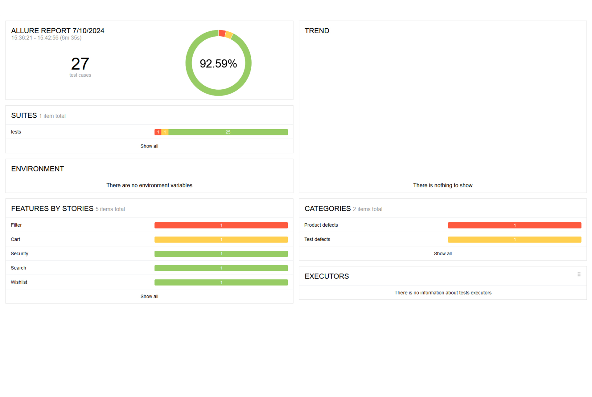
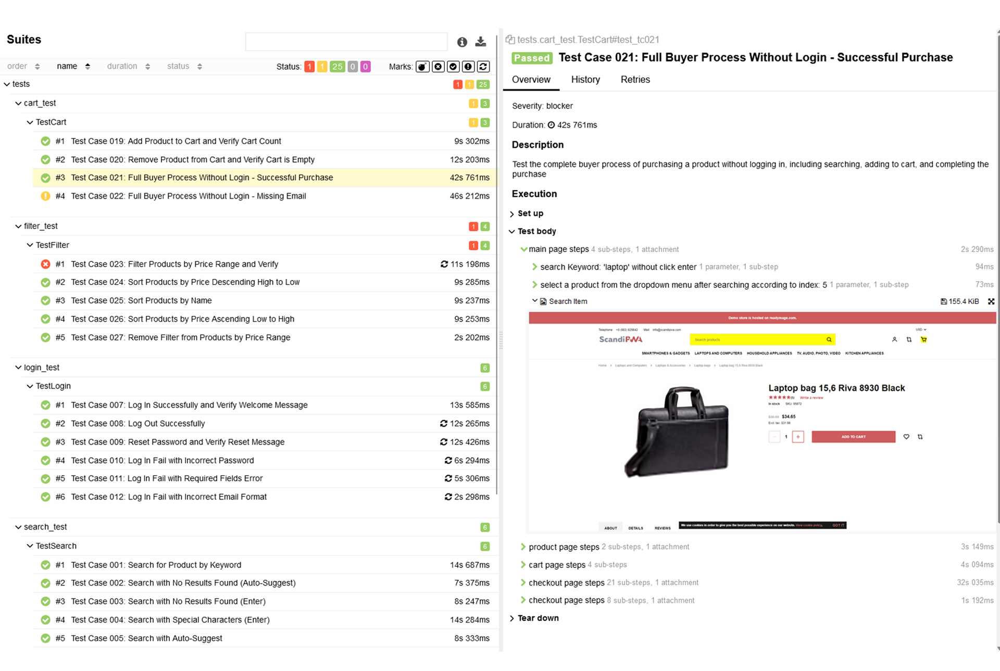
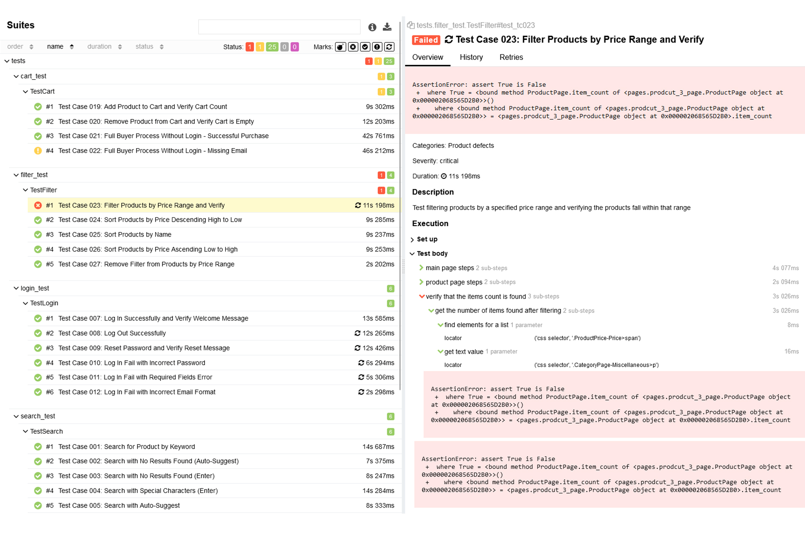

# 💻 My Automation Project 
✅ This is a testing automation project that tests a demo site for an e-commerce website called: 
[httpwww.tech-demo.scandipwa.com](https://tech-demo.scandipwa.com/)

## 📖 Overview

This repository contains a comprehensive automated testing project built with Python, Selenium, and Allure Reports. 
The project follows the Page Object Model (POM) design pattern for a modular and maintainable test suite.

<p>
  
</p>

## 📑 Technologies & Skill & Features
| Technologies      | Description |
| ----------- | ----------- |
| **Python:**      | The project is developed using Python, providing a robust and widely used programming language for automation.      |
| **Selenium WebDriver:**   | The project includes Selenium WebDriver for automating browser interactions.       |
| **Page Object Model (POM):**   | The project follows the POM design pattern, enhancing test maintainability and reusability by separating page elements and actions.        |
| **Allure Reports:**   | Test results are documented using Allure Reports, providing a clear and interactive visualization of test execution.        |
| **Git:**   | Version control is managed using Git, ensuring efficient collaboration, tracking, and management of code changes.        |


## 📊 Reports
  ```bash
  pytest --alluredir=allure-results
  ```
## 📊 Reports Examples
<p>
  
  
  
</p>


## 📖 Prerequisites

**Python Installation:**
   - Install Python (version 8.2.2).
     
**Selenium WebDriver:**
   - Install Selenium WebDriver (version 4.22.0):
     ```bash
     pip install selenium
     ```
**Allure Reports Installation:**
  - Install Allure-Pytest (version 2.13.5).

**Chocolatey Package Manager Installation:**
  - Install Chocolatey
    
**Git:**
   - Install Git for version control by chocolatey. 

## 🚀 Getting Started

1. **Clone the Repository:**
   ```bash
   git clone https://github.com/mkeren1980/FinalProjectAuomation.git
    ```

## 📁 Project Structure
```

```

Thanks for visiting my GitHub profile! 😊
Keren Miron Bezalel
